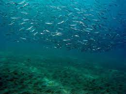
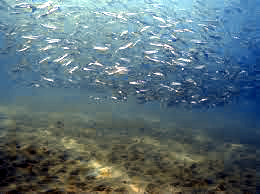
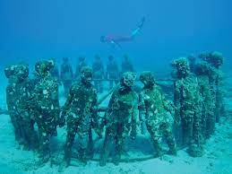
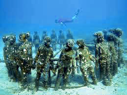

# underwater-color-correction
This cli tool can be used to perform color correction to underwater pictures.
Runs over an entire directory

## Installation
Clone this repo, `run npm install && npm install --dev`

## Usage
```
./src/index.ts -d <input-dir> -o <output-dir>
```







